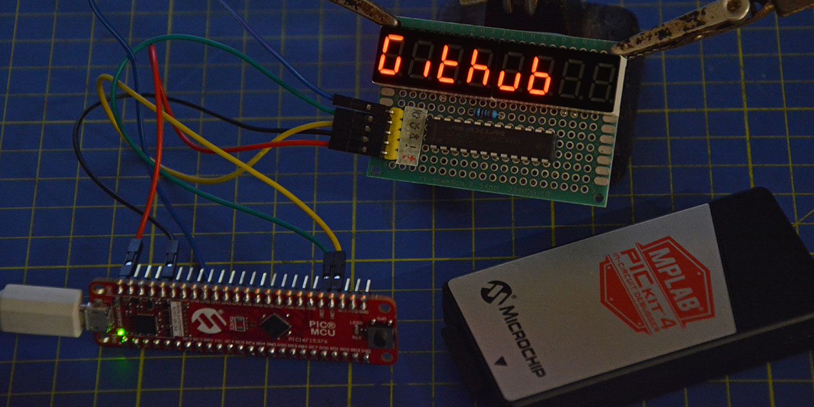

# MAX7219 Library for Microchip(R) PIC(R) microcontrollers

**Version: 1.0**  

This is a library for MAX7219 and 7-segments displays (no led matrix) to be used with Microchip(R) PIC(R) microcontrollers.  
Library is licensed under [AGPLv3 license](https://github.com/Cyb3rn0id/MAX7219_PIC_lib/blob/master/LICENSE).  

You can read how MAX7219 works on my blog [in this page](https://www.settorezero.com/wordpress/max7219-pilotare-display-a-7-segmenti-o-matrici-di-led-e-un-gioco-da-ragazzi/) => It's in italian language but I've included a translation service on the right bar where you can select your language.  

  
  
## Preliminary Info

### Microcontroller Instruction Cycle
Library is tested with Microchip PIC Microcontrollers up to 32MHz. The critical part is that MAX7219 needs a minimum pulse duration of 50nS. With a 32MHz 8bit PIC there are about 62,5nS pulse durations (instruction cycle of a PIC12/16/18 is 4 clock cycles). Using a PIC microcontroller having a Fosc>32MHz you need to insert delays between clock and latch pulses.  

### Pins used
MAX7219 needs 3 GPIOs (General Purpose Input/Output).

### Limitations
Library is currently tested for a single MAX7219 (8 Digits) and only for 7-segment displays. Led Matrix are not supported.

### Misc Info
Digits are numbered from right (1) to left (8)  
  
## Libray Setup

It's reccomended to use the [MPLAB(R) Code Configurator](https://www.microchip.com/mplab/mplab-code-configurator). Choose 3 pins, make them digital outputs and rename them as: _MAX_DAT_, _MAX_CLK_ and _MAX_LAT_:  

- _MAX_DAT_ : connected to MAX7219 _DIN_ pin (pin n°1)
- _MAX_CLK_ : connected to MAX7219 _CLK_ pin (pin n°13)
- _MAX_LAT_ : connected to MAX7219 _LOAD/!CS_ pin (pin n°12)

> Library uses the _PIN_SetLow()_ and _PIN_SetHigh()_ functions created by the Code Configurator, so the main library file (_MAX7219sz.c_) includes the "mcc_generated_files/pin_manager.h" file. The _device_config.h_ file is also included because in this header is defined the _XTAL_FREQ_ value, used by XC8 builtin delay functions.

Now you can make changes in the header library file (_MAX7219sz.h_):  

- change _DIGITS_ value to fit your display. Actually the library is tested only for 8 digits
- if you want to use different delay libraries, change _DELAYCURSOR_ and _DELAYSCROLL_ macros. You can also change the delay values in those two macros if you desire different writing/scrolling speeds. 
- change eventually _SCROLLBUFFER_ value if you want to use scrolling effect with less chars. See _MAX7219_scroll_ function description for further informations.
  
  
## Library Functions

```c
void MAX7219_init(void)
```
Initialize the MAX7219 using the number of digits defined by constant _DIGITS_ in library header file, _NODECODE_ mode, max brightness.

---

```c
void MAX7219_clear(void)
```
Clears all digits for both _DECODE_ and _NODECODE_ modes.  
Display remains ON: only internal shift register is cancelled.  

---

```c
void MAX7219_clearc(void)
```
Clears all digits using the cursor effect from right to left.  
This function is used only for the _NODECODE_ mode.  
Display remains ON: only internal shift register is cancelled.  

---

```c
void MAX7219_send(uint8_t reg, uint8_t dat)
```
Sends a byte to the selected register.
- _reg_: MAX7219 register to write in
- _dat_: data to be written in the register  

Note: This function is used also for writing symbols in the _NODECODE_ mode, in that case the _dat_ value must define wich segments must be turned on. Example:  
_MAX7219_send(8,SEGA|SEGB|SEGF|SEGG|SEGE|SEGC)_ => writes the A letter on the 8th digit (the most-left digit) by turning all segments but segment d and comma/point.

---

```c
void MAX7219_putch(uint8_t digit, char ch, bool point)
```
Writes a single char on the selected digit.  
- _digit_: digit number to write on (from 1 to 8)
- _ch_: char to write (ex.: 'g', '1', '.' ecc)
- _point_: will turn on (_true_) or off (_false_) the point/comma on the selected digit  

Note: you can use both uppercase and lowercase letters, in every case letters will be converted to use the defined font in the library header.  
You can write all letters but W,X that can't be effectively rendered on 7-segments displays. Some other chars will look weird (the Z is rendered as 2) but..hey... it's a 7-segment display!  

---

```c
void MAX7219_numch(uint8_t digit, uint8_t n, bool point)
```
Writes a number as char on the selected digit.
- _digit_: digit number to write on (from 1 to 8)
- _n_: number to write, inserted as integer from 0 to 9
- _point_: will turn on (_true_) or off (_false_) the point/comma on the selected digit

---

```c
void MAX7219_setDecode(void)
```
Turns on the _DECODE_ Mode (BCD Code B).  
From this moment you can't use the user-defined font and you must use only the _MAX7219_send_ function for writing numbers from 0 to 9 and H,E,L,P letters and minus sign.  

---

```c
void MAX7219_setNoDecode(void)
```
Turns on the _NODECODE_ mode (you must use chars and numbers as defined in the library header).  

---

```c
void MAX7219_setIntensity(uint8_t val)
```
Set the display brightness.  
- _val_: value from 0 (lowest) to 9 (highest)  

Note: any value higher than 9 will be converted in 9.

---

```c
void MAX7219_test(void)
```
Turns on the test mode (all leds on).   
For exiting the test mode you must recall the _MAX7219_init_ function since the test mode overwrites all settings.  

---

```c
void MAX7219_shutdown(bool yesno)
```
Turns on or off the display visualization.  
- _yesno_: _true_:no display visualization | _false_:display is on.  

Note: shift register content is not deleted, so digits data are retained.  

---

```c
void MAX7219_puts(const char *s, bool cursor)
```
Writes a string on the display using the font defined in the library header, using or no the cursor visual effect, from left to right.  
- _s_: string to write (ex.: _"hello"_)
- _cursor_: _true_:use the cursor effect | _false_:string appears on the digits without visual effects  

---

```c
uint8_t MAX7219_putun(uint16_t num, uint8_t pointPos, uint8_t rightspace)
```
Writes a unsigned 16bit integer by eventually turning on the comma/point on a certain digit and eventually leaving some space on the right if you want to put a simbol or simply left-align the number.    
- _num_: 16 bit unsigned integer (0 to 65535).
- _pointPos_: digit where turning on the comma/point, from 1 to 8. Put 0 if you don't want to turn on the point.
- _rightspace_: places to leave free on the most-right position. Put 0 if you want to right-align the number.  

Returns: position of most-left printed digit.

Numbers are right-aligned, you can use _rightspace_ parameter also for move them on the left.  

_pointPos_ is intended to be used for fixed-point decimal notation. So if you must print a decimal number, you can multiply it by a power of 10 to transform it in an integer and then turn on the point/comma on the desidered digit.    

Function will remove also previous numbers from digits if the current number to be printed is smaller than previous one: if you print "12345" and after you'll print "1" in other cases you'll visualize 12341 since you're printing 1 and the previous digits will remain. The library keeps in mind the most-left used digit and will remove all previous digits until the new ones but does not perform a display clear that will cause flickering: only previous unused digits are cancelled.  

---

```c
uint8_t MAX7219_putsn(int16_t num, uint8_t pointPos, uint8_t rightspace)
```
As above but writes a 16bit signed integer by putting a minus sign near the most-left digit.  
- _num_: 16 bit signed integer (-32768 to 32767).
- _pointPos_: digit where turning on the comma/point, from 1 to 8. Put 0 if you don't want to turn on the point.
- _rightspace_: places to leave free on the most-right position. Put 0 if you want to right-align the number.  

Returns: minus sign position (position of most-left printed digit).  

All considerations made for the _MAX7219_putun_ are applied also to this function.  

---

```c
void MAX7219_scroll(const char *s, bool disappear)
```
Writes a constant string using scrolling effect, from right to left.
- _s_: String
- _disappear_: _true_: string will scroll out of the display | _false_: last _DIGITS_ chars of the string will remain visualized  

Note: the maximum amount of string chars is given by _SCROLLBUFFER_-1-_DIGITS_-(_DIGITS_ * _disappear_), since _DIGITS_ spaces are added on the left of the string and eventually other _DIGITS_ spaces on the right if you use the _disappear_ flag in this function. So if _SCROLLBUFFER_ is 80, your display has 8 digits and you use the _disappear_ flag, you can write max 63 chars.

## Support me ##
  
If you want to support my free work, you can make me a gift from my [amazon wishlist](https://www.amazon.it/gp/registry/wishlist/DX4SUGLWNLYB/) or give a reading [here](https://www.settorezero.com/wordpress/info/donazioni/)

## Trademarks ##
Microchip, PIC are registered trademarks property of Microchip Technology Inc. [Here is a list](https://www.microchip.com/about-us/legal-information/trademarks/microchip-trademarks) of Microchip Technology Inc. trademarks.
Maxim is a registered trademark property of Maxim Integrated Products Inc. [Here is a list](https://www.maximintegrated.com/en/legal/trademarks.cfm) of Maxim Integrated Products trademarks.
All other brands or product names are property of their respective holders.  
